# Диаграммы

Все диаграммы записаны на языке Mermaid и отрисовываются GitHub автоматически —
исходный текст остаётся в репозитории и правится вместе с кодом.

---

## 1. Диаграмма компонентов

Показывает, из каких частей состоит система и в какую сторону направлены
зависимости.

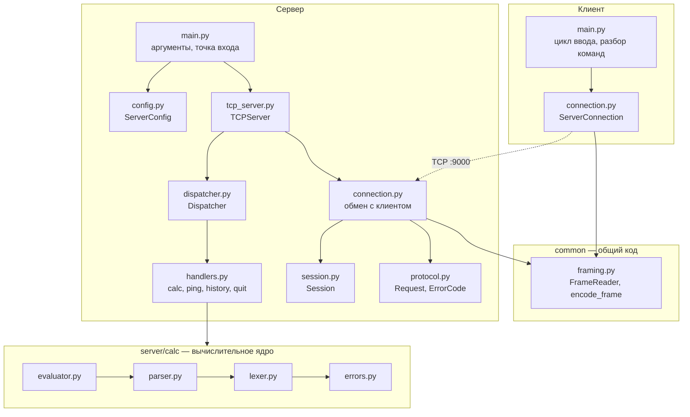

Обрати внимание на два обстоятельства:

- **`common/framing.py` используют обе стороны.** Проблема границ сообщений
  симметрична, дублировать код означало бы чинить каждую ошибку дважды.
- **`server/calc/` не имеет ни одной стрелки в сторону сети.** Это позволяет
  тестировать вычисления без сокетов.

---

## 2. Диаграмма классов: сетевая часть

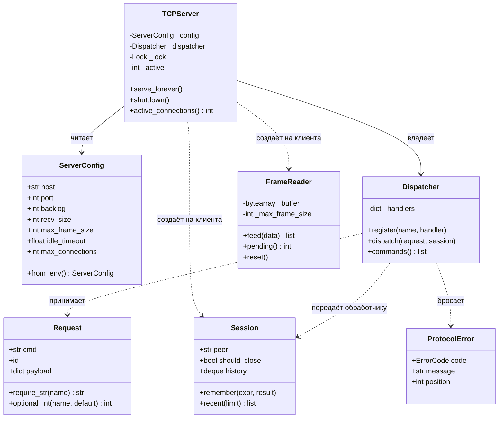

`Dispatcher` один на весь сервер и после сборки только читается, поэтому
делится между потоками без синхронизации. `Session` и `FrameReader` создаются
на каждое соединение и живут внутри своего потока.

---

## 3. Диаграмма классов: дерево разбора

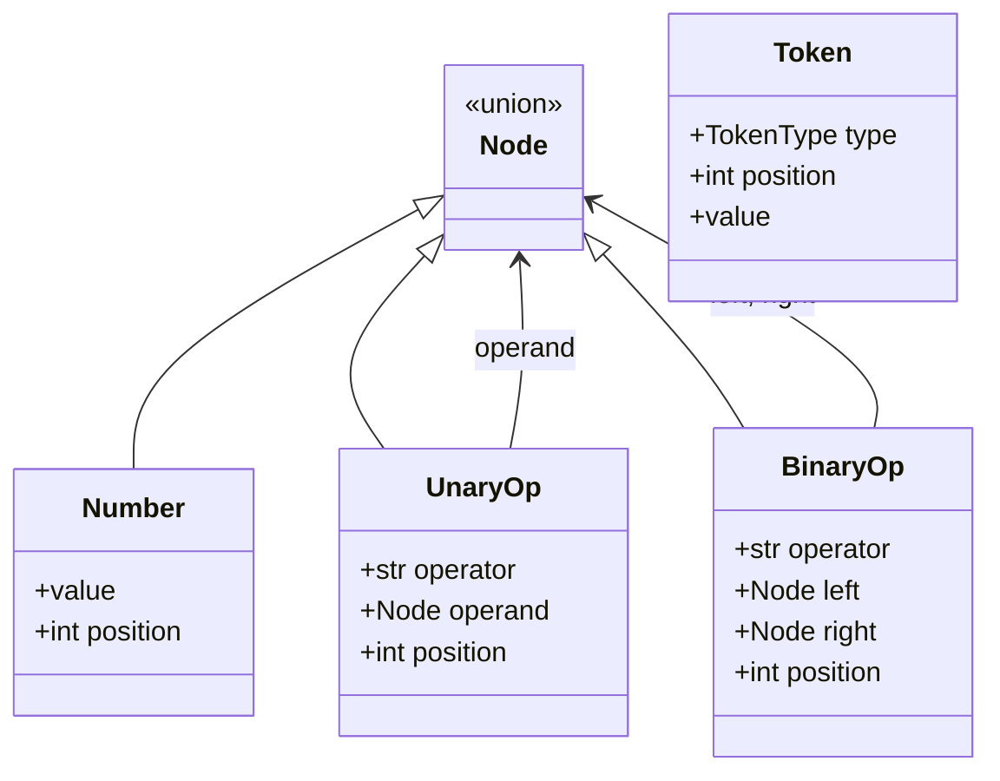

Уточнение: в коде `Node` — не базовый класс, а объединение типов
(`Number | UnaryOp | BinaryOp`). На диаграмме показано наследованием, потому
что смысл тот же: в любом месте, где ожидается узел, допустим любой из трёх.

---

## 4. Диаграмма последовательности: вычисление выражения

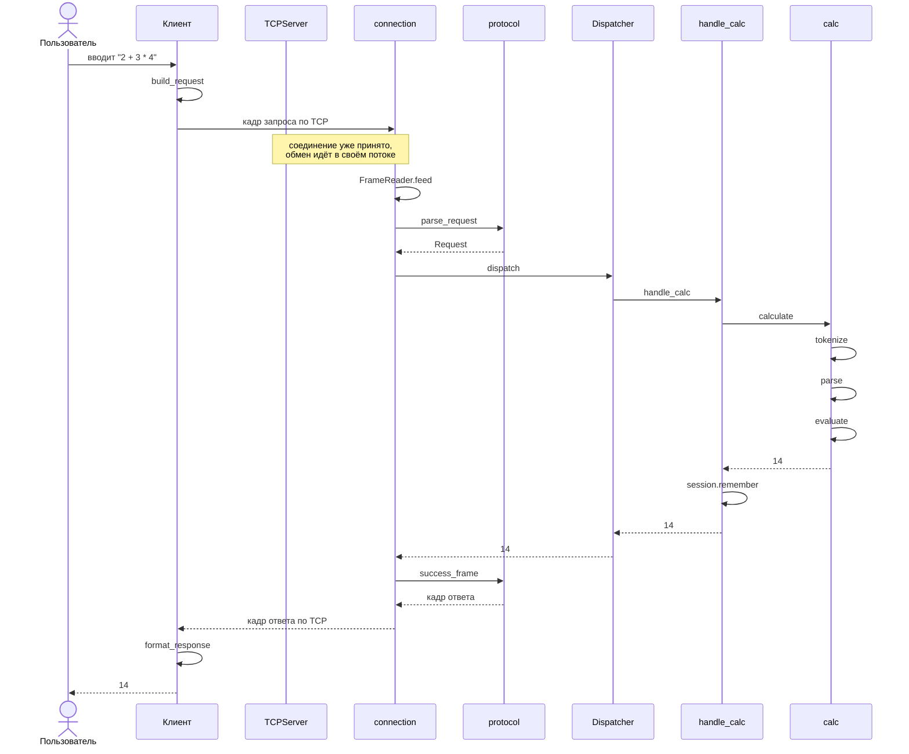

---

## 5. Диаграмма последовательности: ошибка вычисления

Показывает, что ошибка в данных клиента **не разрывает соединение**.

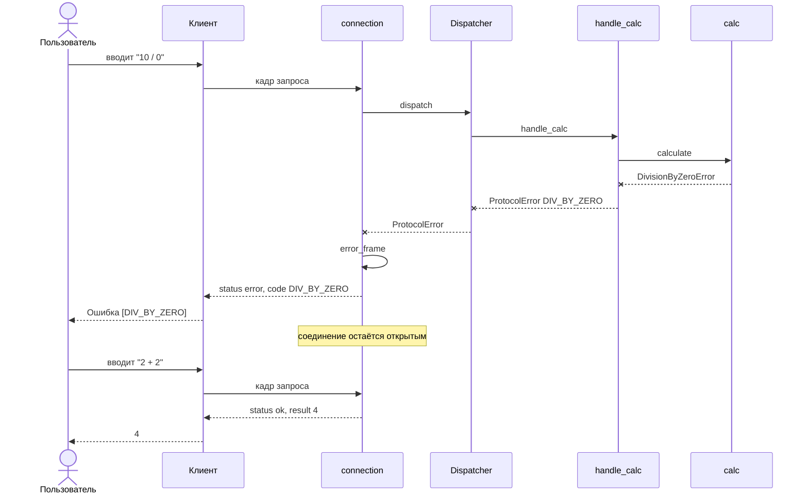

---

## 6. Диаграмма состояний соединения

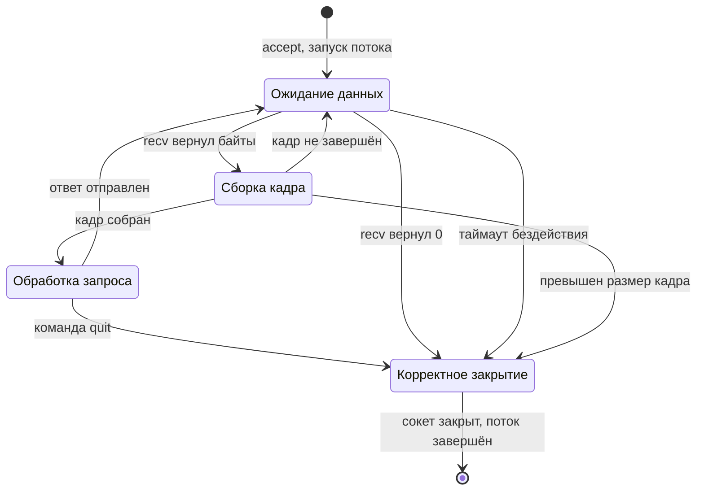

Переход `framing → reading` — тот самый случай, когда сообщение пришло не
целиком: часть байт остаётся в буфере до следующего чтения.

---

## 7. Диаграмма деятельности: обработка одного кадра

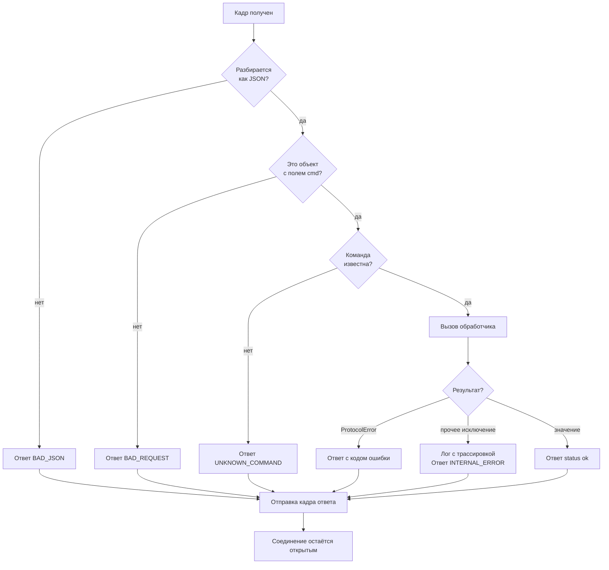

Ключевое свойство: **из этой схемы нет выхода в разрыв соединения.** Любая
беда становится ответом. Соединение закрывается только выше по уровню —
при нарушении фрейминга или по команде `quit`.

---

## 8. Диаграмма потоков сервера

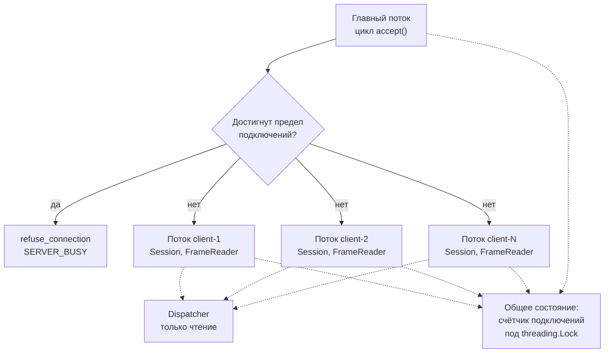

Общего изменяемого состояния всего одно — счётчик. Буфер чтения и история
живут внутри своего потока, поэтому гонкам взяться неоткуда. Это не
случайность, а способ проектирования: надёжнее устранить условия для гонок,
чем расставлять блокировки.

---

## 9. Диаграмма развёртывания

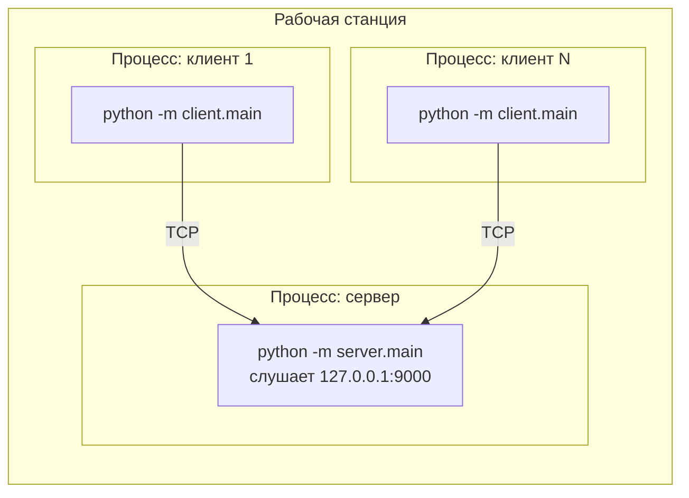

Штатный режим — всё на одной машине через петлевой интерфейс. Для работы по
локальной сети сервер запускается с `--host 0.0.0.0`, клиент получает адрес
машины через `--host`. Шифрования нет, поэтому выставлять сервер в интернет
не следует.

---

## 10. Дерево разбора выражения

Наглядное объяснение того, откуда берётся приоритет операций.

Выражение `2 + 3 * 4`:

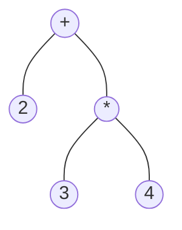

Умножение оказалось **глубже** в дереве, а вычисление идёт снизу вверх:
сначала `3 * 4 = 12`, потом `2 + 12 = 14`. Приоритет нигде не запрограммирован —
он следует из того, что правило «выражение» состоит из «слагаемых», а
«слагаемое» из «множителей».

Для сравнения, `(2 + 3) * 4`:

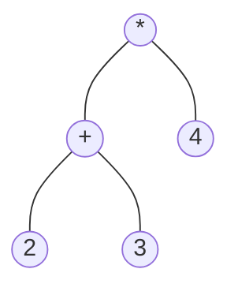

Скобки подняли сложение вниз по дереву, и оно вычисляется первым: `20`.
